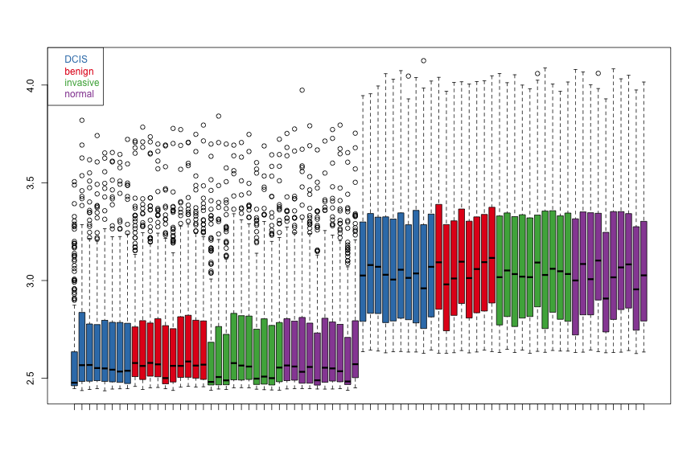
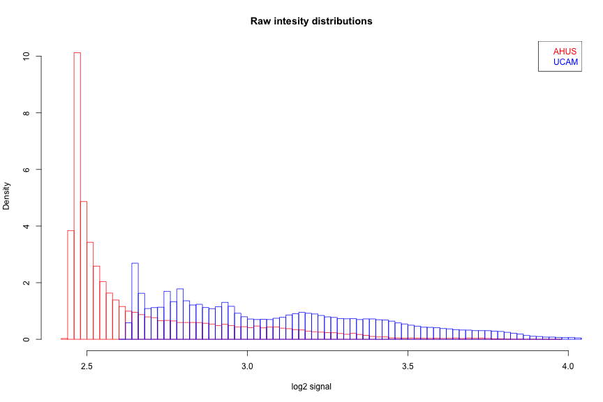
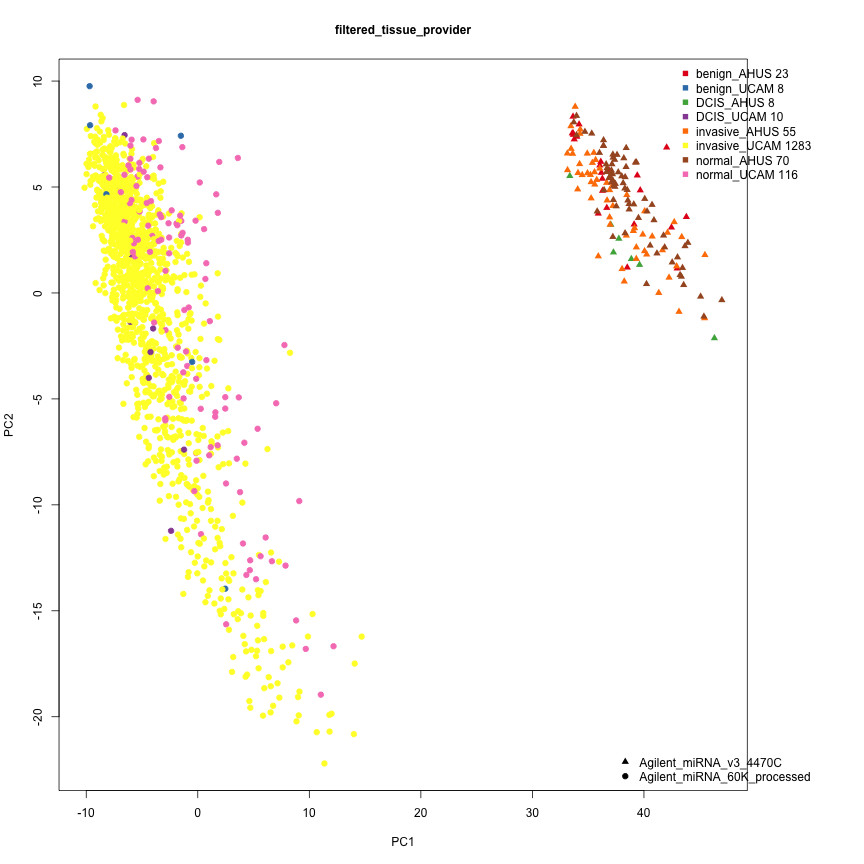
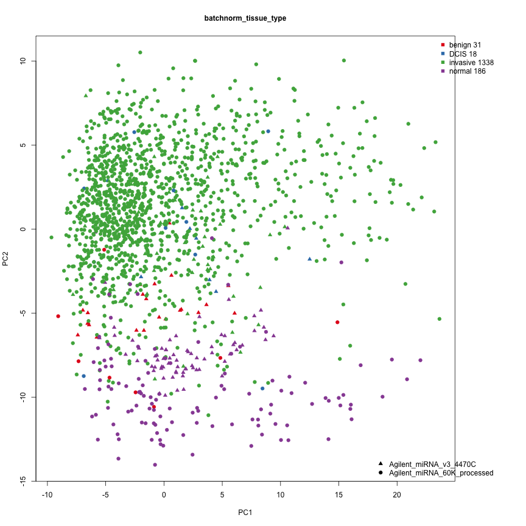
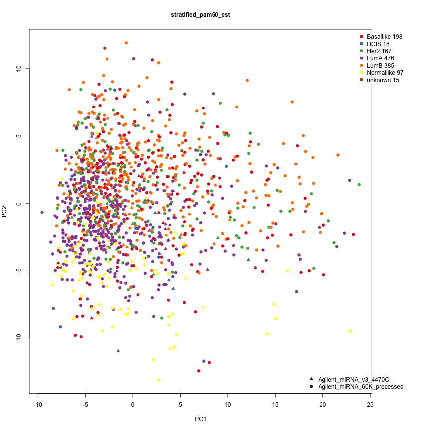
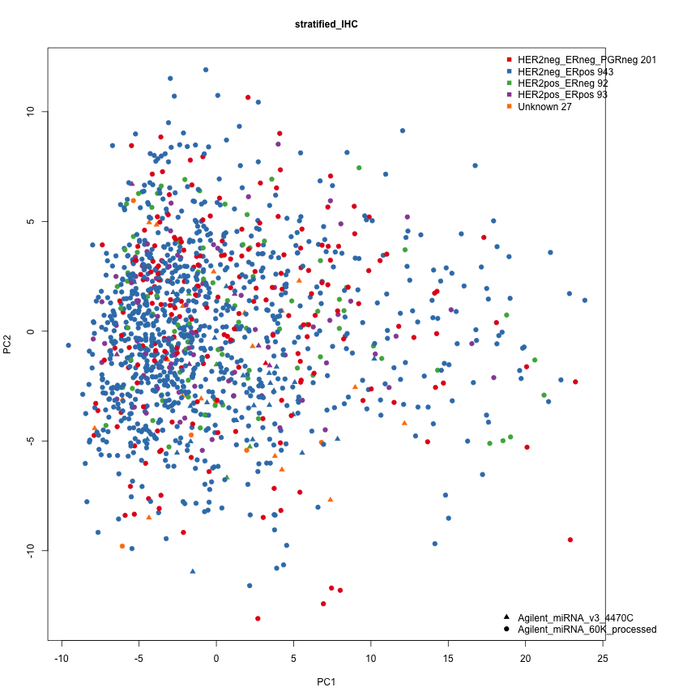

Quality control plots of AHUS and UCAM microRNA data used in Volinia check
========================================================


2015-06-03 17:44:14  
<br/>
<br/>

<br/>
<br/>

## Input data

Setting some dependencies

```r
library(RColorBrewer)
```

```
## Warning: package 'RColorBrewer' was built under R version 3.1.2
```

```r
library(xtable)
library(sva)
```

```
## Warning: package 'mgcv' was built under R version 3.1.2
```

```
## Warning: package 'nlme' was built under R version 3.1.2
```

```r
set.seed(100)

source("./helper_functions.r")
if(!exists("inputisread"))
	source("read_input.r")
```

The data matrix has 1573 samples and 266 microRNAs.


```r
print(xtable(table(sampleannotation[, c("provider", "tissue_type")]), 
             caption="", digits=3), 
      comment = TRUE,
      type = "html",
      html.table.attributes="CELLPADDING=5",
      include.rownames = TRUE)
```

<!-- html table generated in R 3.1.1 by xtable 1.7-4 package -->
<!-- Wed Jun  3 17:44:15 2015 -->
<table CELLPADDING=5>
<caption align="bottom">  </caption>
<tr> <th>  </th> <th> benign </th> <th> DCIS </th> <th> invasive </th> <th> normal </th>  </tr>
  <tr> <td align="right"> AHUS </td> <td align="right">   23 </td> <td align="right">    8 </td> <td align="right">   55 </td> <td align="right">   70 </td> </tr>
  <tr> <td align="right"> UCAM </td> <td align="right">    8 </td> <td align="right">   10 </td> <td align="right"> 1283 </td> <td align="right">  116 </td> </tr>
   </table>

The tissue is not evenly distributed among the providers. "benign" is not part of Volinia et al.s results, but it is kept for now since it is useful for assessing batch differences. 

<br/>
<br/>

## Combining data sets

The data is already combined using the common microRNAs, but QC plots will reveal that batch effects exists.


```r
colorpal = c(brewer.pal(9,"Set1"), brewer.pal(8,"Set2"))
somesamples=vector()
for(p in unique(sampleannotation$provider))
{
  for(t in unique(sampleannotation$tissue_type))
  {
    a = sampleannotation$tissue_type==t & sampleannotation$provider==p
    s = sum(a)
    if(s>=10)
      s=10
    somesamples = c(somesamples,sample(sampleannotation$sample_id[a], s) )  
  }  
}
boxplot(log2(common_matrix[,somesamples ]), names=NA, 
        col=colorpal[as.factor(sampleannotation[somesamples, "tissue_type"])])
legend("topleft", legend=unique(sampleannotation[somesamples, "tissue_type"]),
       text.col=colorpal[ as.factor(unique(sampleannotation[somesamples, "tissue_type"]))])
```

 

The box-plot of a few random samples shows a difference in signal distribution between AHUS and UCAM, but the tissue types seems to have a similar distribution within each provider.
<br/>
<br/>


```r
hist( log2(common_matrix[,sampleannotation$provider=="AHUS"]),
      breaks=100, freq=FALSE, border="red",
      main="Raw intesity distributions", xlab="log2 signal" )
hist( log2(common_matrix[,sampleannotation$provider=="UCAM"]), breaks=100, freq=FALSE, border="blue", add=T )
legend("topright", legend=c("AHUS", "UCAM"), text.col=c("red", "blue"))
```

 

The density plot also reveals the difference and the data from the different providers seems to have been processed differently. 


Next we will see how the samples cluster.

```r
plotmanypca(list( filtered=common_matrix),sampleannotation, "" ,  views=c("tissue_provider"))
```

 

The PCA plot shows that the samples are segregated on provider rather than tissue. Event thought both data sets use Agilent arrays with a lot of the same probes, a clear batch effect is observed. Our tissues and other groupings are not evenly balanced across the data sets, thus ignoring the batch effect would probably lead to false results. Accounting for the batch effect is best done by including the batch information in the statistical tests. This is possible in Limma where batch can be used as a blocking factor much the same way as a two-way ANOVA. Another approach is to analyse the data sets separately and combine the results with a meta-analysis tool. 
<br/>
However, in an attempt to plot and assess the grouping of the samples, the batch effect can partially be adjusted for using the "ComBat" method from the sva-package. This adjusted matrix will only be useful for plotting, since the confidence for the group differences will be overrated.

```r
mod = as.factor(sampleannotation$tissue_type)
common_matrix_batchnorm = ComBat(dat=normalizeBetweenArrays(common_matrix, method="quantile"),
                                                batch=as.factor(sampleannotation$provider),
                                                mod=mod,  par.prior=TRUE, prior.plots=FALSE)
```

```
## Found 2 batches
## Found 1  categorical covariate(s)
## Standardizing Data across genes
## Fitting L/S model and finding priors
## Finding parametric adjustments
## Adjusting the Data
```


After batch adjustment in ComBat the PCA-plot looks like this;

```r
plotmanypca(list(batchnorm=common_matrix_batchnorm),sampleannotation, "" ,  views=c("tissue_type"))
```

 

But be aware that we instructed the batch adjustment to preserve what looks like group differences (but might not be). So the group similarities are unreliable. These plots are useful for checking the groupings of other sample annotations like IHC and pam50 classification.


## Stratification based on pam50 classification.

Pam50 classification has been done on the mRNA samples. Many of the microRNA samples also have a mRNA sample and thus a pam50 classification. 
We have too few samples for looking at the DCIS to invasive change for each of the pam50 classes. Therefore we will treat all DCIS as "DCIS".


```r
sampleannotation$pam50_est[sampleannotation$tissue_type=="DCIS"]="DCIS"
table(sampleannotation[,c("pam50_est", "tissue_type")], useNA="ifany")
```

```
##             tissue_type
## pam50_est    benign DCIS invasive normal
##   Basallike       2    0      198      0
##   DCIS            0   18        0      0
##   Her2            0    0      167      0
##   LumA            3    0      476      9
##   LumB            0    0      385      1
##   Normallike     12    0       97    105
##   unknown        14    0       15     71
```

PCA-plot with the pam50 labels. DCIS and invasive samples only.


```r
plotmanypca(list( stratified=common_matrix_batchnorm[,sampleannotation$tissue_type %in% c("DCIS", "invasive")]),
						sampleannotation[sampleannotation$tissue_type %in% c("DCIS", "invasive"),], "" ,  views=c("pam50_est"))
```

 

This looks like a separation.

## Stratification based on clinical diagnostics from Immunohistochemistry.

Many of the samples are also diagnosed based on immunohistochemistry of HER2, PGR and ER proteins. Four diagnoses are used, 
"HER2neg/ERneg/PGRneg", "HER2neg/ERpos", "HER2pos/ERneg", "HER2pos/ERpos". 
We would like too look for microRNA that separates samples based on that grouping as well.


```r
sampleannotation$IHC[sampleannotation$IHC==""] = "Unknown"
table(sampleannotation[,c("tissue_type", "IHC")], useNA="ifany")
```

```
##            IHC
## tissue_type HER2neg_ERneg_PGRneg HER2neg_ERpos HER2pos_ERneg HER2pos_ERpos
##    benign                      5             2             0             0
##    DCIS                        2             3             5             0
##    invasive                  199           940            87            93
##    normal                      0             0             0             0
##            IHC
## tissue_type unknown
##    benign        24
##    DCIS           8
##    invasive      19
##    normal       186
```


PCA-plot with the IHC labels. DCIS and invasive samples only.


```r
plotmanypca(list( stratified=common_matrix_batchnorm[,sampleannotation$tissue_type %in% c("DCIS", "invasive")]),
						sampleannotation[sampleannotation$tissue_type %in% c("DCIS", "invasive"),], "" ,  views=c("IHC")  )
```

 

The IHC labels do not seem to cluster.


<br/>
<br/>
<br/>


```r
sessionInfo()
```

```
R version 3.1.1 (2014-07-10)
Platform: x86_64-apple-darwin10.8.0 (64-bit)

locale:
[1] en_US.UTF-8/en_US.UTF-8/en_US.UTF-8/C/en_US.UTF-8/en_US.UTF-8

attached base packages:
[1] parallel  stats     graphics  grDevices utils     datasets  methods  
[8] base     

other attached packages:
 [1] sva_3.10.0            mgcv_1.8-4            nlme_3.1-120         
 [4] corpcor_1.6.7         xtable_1.7-4          RColorBrewer_1.1-2   
 [7] knitr_1.9             AgiMicroRna_2.14.0    affycoretools_1.36.1 
[10] GO.db_2.14.0          RSQLite_1.0.0         DBI_0.3.1            
[13] AnnotationDbi_1.26.1  GenomeInfoDb_1.0.2    preprocessCore_1.26.1
[16] affy_1.42.3           limma_3.20.9          Biobase_2.24.0       
[19] BiocGenerics_0.10.0   data.table_1.9.2      plyr_1.8.1           

loaded via a namespace (and not attached):
 [1] acepack_1.3-3.3           affyio_1.32.0            
 [3] annaffy_1.36.0            annotate_1.42.1          
 [5] AnnotationForge_1.6.1     base64enc_0.1-2          
 [7] BatchJobs_1.5             BBmisc_1.9               
 [9] BiocInstaller_1.14.3      BiocParallel_0.6.1       
[11] biomaRt_2.20.0            Biostrings_2.32.1        
[13] biovizBase_1.12.3         bit_1.1-12               
[15] bitops_1.0-6              brew_1.0-6               
[17] BSgenome_1.32.0           Category_2.30.0          
[19] caTools_1.17.1            checkmate_1.5.1          
[21] cluster_2.0.1             codetools_0.2-10         
[23] colorspace_1.2-4          DESeq2_1.4.5             
[25] dichromat_2.0-0           digest_0.6.8             
[27] edgeR_3.6.8               evaluate_0.5.5           
[29] fail_1.2                  ff_2.2-13                
[31] foreach_1.4.2             foreign_0.8-63           
[33] formatR_1.0               Formula_1.2-0            
[35] gcrma_2.36.0              gdata_2.13.3             
[37] genefilter_1.46.1         geneplotter_1.42.0       
[39] GenomicAlignments_1.0.6   GenomicFeatures_1.16.3   
[41] GenomicRanges_1.16.4      ggbio_1.12.10            
[43] ggplot2_1.0.0             GOstats_2.30.0           
[45] gplots_2.16.0             graph_1.42.0             
[47] grid_3.1.1                gridExtra_0.9.1          
[49] GSEABase_1.26.0           gtable_0.1.2             
[51] gtools_3.4.1              Hmisc_3.15-0             
[53] hwriter_1.3.2             IRanges_1.22.10          
[55] iterators_1.0.7           KernSmooth_2.23-14       
[57] lattice_0.20-30           latticeExtra_0.6-26      
[59] locfit_1.5-9.1            MASS_7.3-39              
[61] Matrix_1.1-5              munsell_0.4.2            
[63] nnet_7.3-9                oligoClasses_1.26.0      
[65] PFAM.db_2.14.0            proto_0.3-10             
[67] R.methodsS3_1.7.0         R.oo_1.19.0              
[69] R.utils_1.34.0            R2HTML_2.3.1             
[71] RBGL_1.40.1               Rcpp_0.11.4              
[73] RcppArmadillo_0.4.650.1.1 RCurl_1.95-4.5           
[75] ReportingTools_2.4.0      reshape2_1.4.1           
[77] rpart_4.1-9               Rsamtools_1.16.1         
[79] rtracklayer_1.24.2        scales_0.2.4             
[81] sendmailR_1.2-1           splines_3.1.1            
[83] stats4_3.1.1              stringr_0.6.2            
[85] survival_2.38-1           tools_3.1.1              
[87] VariantAnnotation_1.10.5  XML_3.98-1.1             
[89] XVector_0.4.0             zlibbioc_1.10.0          
```

generation ended 2015-06-03 17:44:20. Time spent 0 minutes .
